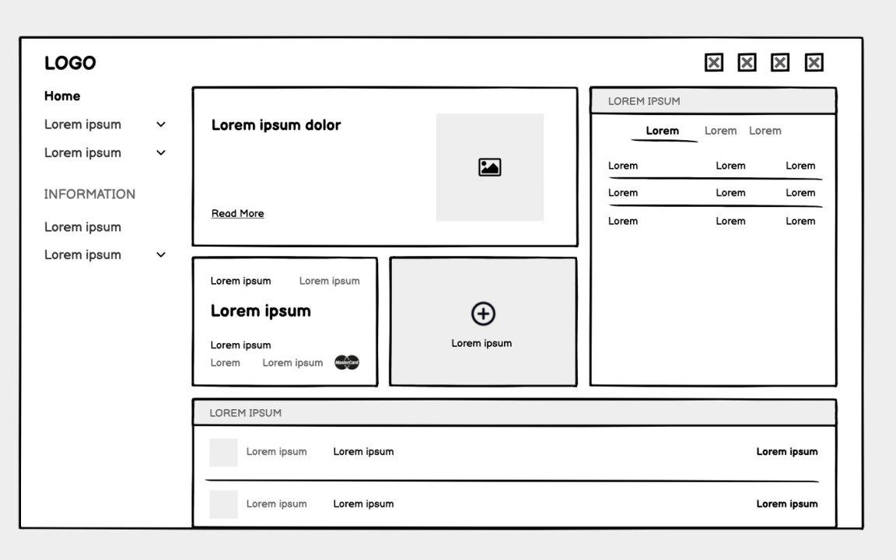

<!-- prettier-ignore-start -->

# Module 10: Low-Fidelity Prototyping
{: .no_toc }

Low-fidelity prototyping is a technique used in the field of design and product development to quickly and inexpensively create rough representations of ideas or concepts. It involves creating simple and basic versions of a product or system, typically using materials such as paper, cardboard, or digital tools like wireframing software. 

## Table of Contents
{: .no_toc }

1. TOC
{:toc}

<!-- prettier-ignore-end -->

## Outcomes

Upon completion of this module, you should be able to:

- Build a (low fidelity) prototype that incorporates wireframes to create a simple but effective software solution.

## Testing Ideas

The primary goal of low-fidelity prototyping is to explore and test different design ideas, interactions, and user experiences early in the development process. It allows designers and stakeholders to gather feedback, make iterations, and validate concepts before investing significant time and resources in higher fidelity prototypes or the final product.

Low-fidelity prototypes are intentionally simple and lack the intricate details and functionality of a finished product. They focus on conveying the core concepts and interactions in a tangible form, allowing users or stakeholders to provide input and evaluate the design's feasibility, usability, and effectiveness.

Common examples of low-fidelity prototypes include paper sketches, storyboards, physical models made of simple materials, interactive wireframes, or even digital mockups without advanced functionality. These prototypes are quick to create, modify, and discard, enabling a rapid and iterative design process.

## Example Wireframes

Whether you're working on websites, desktop or mobile applications, wireframes can clearly visualize what an end product may look like like.

Overall, low-fidelity prototyping is a valuable technique for exploring ideas, gathering feedback, and refining designs early in the development cycle, helping to save time, resources, and mitigate risks associated with more complex and costly iterations later on.

## Module Resources

A helpful batch of links to resources that may have been used for activities and/or discussions during this week's module.

Resources to read prior to class:

1. [Paper Prototyping](https://www.nngroup.com/articles/paper-prototyping/)

1. [Why You Should Draw Wireframes](https://www.nngroup.com/articles/draw-wireframe-even-if-you-cant-draw/)

## What's Next

A clever segue into the next module.

## Glossary

Here we'll create a list of the module's key terms
