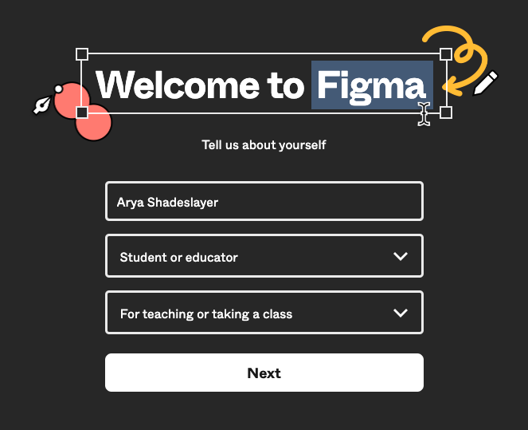
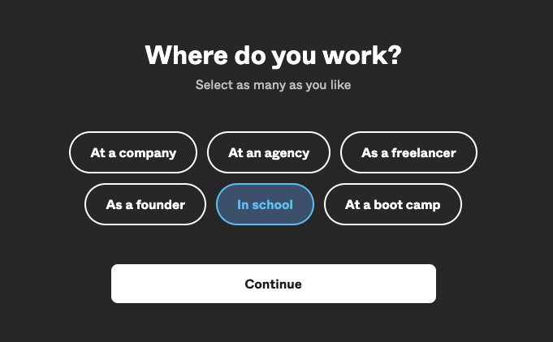
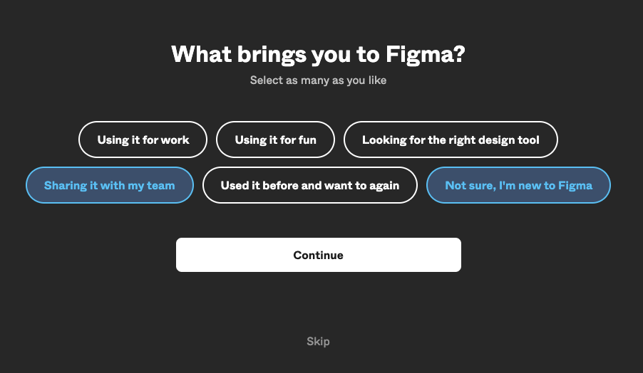
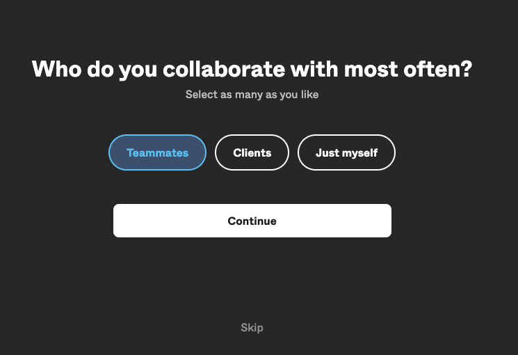
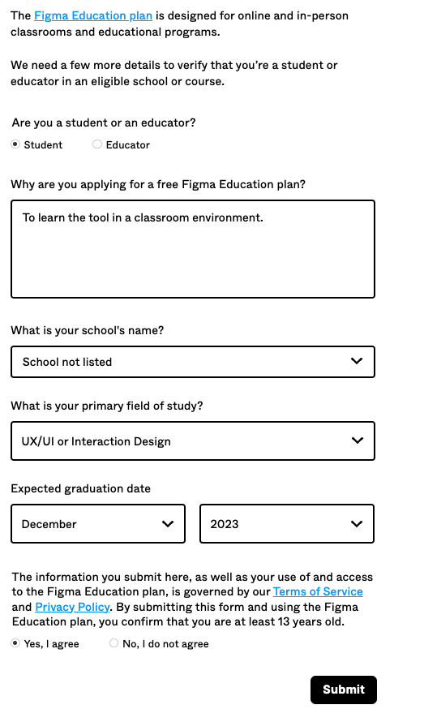
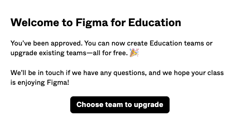

<!-- prettier-ignore-start-->

# Module 2: Applying UX Perspectives and Tools
{: .no_toc }

An insightful yet charming intro into this module's content.

## Table of Contents
{: .no_toc }

1. TOC
{:toc}
      
<!-- prettier-ignore-end -->

## Outcomes

Upon completion of this module, you should be able to:

- Apply UX perspectives and tools, such as user-centered design and design thinking, in the preliminary stages of a software development project to ensure a user-focused approach.

- Describe the difference between UI and UX and CX

## Figma

[Figma](https://www.figma.com) is a cloud-based application used for interface design. Figma focuses on user interface and user experience design, with an emphasis on real-time collaboration.

Create an account using your RRC Polytech email address to get pro features for free!

**Registration Process**

1. Visit [Figma](https://www.figma.com) and on the top right click "Get Started". 

1. Sign up for Figma using your RRC Polytech email address. 

1. Fill out the "About You" section. Ensure you mention you're a student in a class. 

1. Say that you're in school at the moment. 

1. If you like, include what's bringing you to Figma and who you collaborate with, but you can skip this part if you like.  

**Get Verified as a College Student**
Right now you are set up for the free Figma account. But as a college student, you're entitled to get Figma's Pro features with your college credentials!

1. Visit [Figma Education](https://www.figma.com/education) and click on "Get Verified". 

1. Fill out Figma's verification form similar to as shown below. 

1. That's it! Next you should see that you are verified and able to use Figma's Pro features!  Create a workspace and start having fun with all the options. [This Intro Video](https://youtu.be/jk1T0CdLxwU?t=85) may help!

## Concepts and Resources

Here we'll discuss the topic, add links to resources, and any supportive images/graphs/charts that might be helpful.

## What's Next

A clever segue into the next module.

## Glossary

Here we'll create a list of the module's key terms
