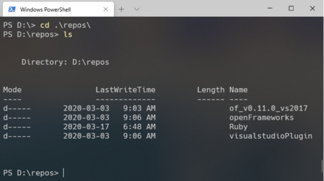
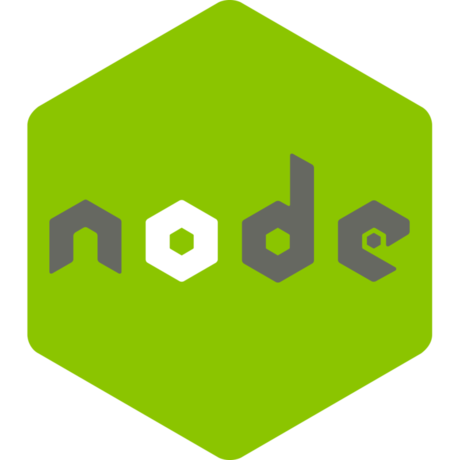

<!--prettier-ignore-start-->
## Tooling Setup 
{: .no_toc }

Working with 3rd party modules in Javascript means working at the command line. It also requires us to use a package manager like npm, the Node Package Manager.

In this section we will install and configure the required tooling.

## Table of Contents
{: .no_toc .text-delta }  

1. TOC
{:toc}

<!--prettier-ignore-end-->

## In the Beginning

{:class="small inline"}

### Was the Command Line

The **command line** is a text-based interface for your operating system (OS). We run command line interface (CLI) tools using a **terminal**.

Web developers use CLI tools to write, test, and deploy their work.

In this lesson we'll be using a CLI tool to manage Javascript code modules.

#### 👋 Mac and Linux Users

Historically both MacOS and Linux have had a better terminal/CLI experience than Windows. It's [getting better in Windows-land](https://aka.ms/terminal), but many web dev professionals still favour Mac or Linux machines for this reason.

#### Resources

- [In the Beginning was the Command Line](http://cristal.inria.fr/~weis/info/commandline.html) by Neal Stephenson

## Required Tools

{:class="small inline"}

We need two things before we can proceed.

### Node Package Manager

To explore Javascript modules we need a way to install packages of modules written by other developers. For this we'll use the package manager that comes with NodeJS.

### VS Code Editor

VS Code is a free open-source code editor from Microsoft that runs on Windows, MacOS, and Linux. VS Code includes a built-in command line terminal and a healthy plugin ecosystem.

#### Resources

- [VS Code Plugin Repository](https://marketplace.visualstudio.com/vscode)

## A Word on Node

{:class="small inline"}

[NodeJS](https://nodejs.org) makes it possible to run Javascript applications outside of the browser.

With Node we can [write server-side code in JS](https://expressjs.com/) or [build cross-platform apps using web technologies](https://www.electronjs.org/). Super cool, but...

**NodeJS app development is outside the scope of this course.**

We're installing Node to use the Node Package Management application `npm`.

## Tools Installation

### NPM via NodeJS

**Windows:** [Use the `.msi` installer for the LTS version of NodeJS](https://nodejs.org/en/download/)

**MacOS:** [Use the `.pkg` installer for the LTS version of NodeJS](https://nodejs.org/en/download/) (Or use [homebrew](https://brew.sh/).)

**Ubuntu / Debian:** [Follow the "Option 2" PPA instructions shown here](https://www.digitalocean.com/community/tutorials/how-to-install-node-js-on-ubuntu-20-04#option-2-—-installing-node-js-with-apt-using-a-nodesource-ppa).

Instructions for other Linux flavours [are also available](https://nodejs.org/en/download/package-manager/).

### VS Code

**Windows, Mac, Linux:** [Install VS Code](https://code.visualstudio.com/).

You are free to use other editors like Atom or Sublime for this course. That said, these notes include VS Code specific material and your instructor will be using VS Code for coding demos.

## VS Code Settings

From the File Menu navigate to Preferences and then to Settings.

Search for and set the following settings.

Auto-save files 250ms after you switch tabs or leave the editor:

- Auto Save: onFocusChange
- Auto Save Delay: 250

Remove all whitespace at the end of lines:

- Trim Trailing Whitespace: true (or checked)

### Advanced Settings

For certain setting you will need to edit the VS Code `settings.json` file.

For example, it's very common to use only two spaces for Javascript indentation. Let's configure this manually.

From the Settings page click on the "Open Settings (JSON)" button at the top right. The icon is a document with an arrow.

Add the following key/value pair within the JSON object:

```javascript
"[javascript]": {
  "editor.tabSize": 2
},
```
