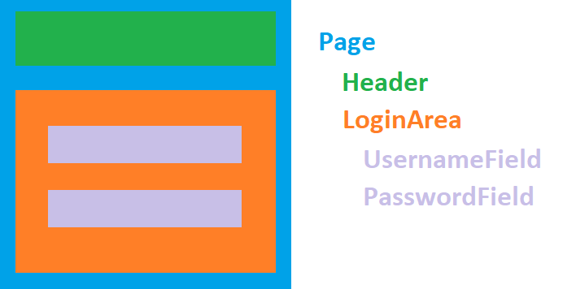
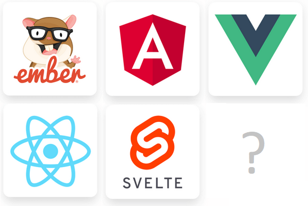

<!--prettier-ignore-start-->
## What are Components and Component Libraries?
{: .no_toc }

## Table of Contents
{: .no_toc .text-delta }  

1. TOC
{:toc}

<!--prettier-ignore-end-->

## Single Page Applications

{:class="small inline"}

Up to this point in the course we've been building sites with server-generated markup where every user interaction causes the browser to load a new server-rendered page.

Client-rendered applications are also possible and are called **Single Page Applications** or **SPA**s for short.

Once a browser loads an SPA:

- All user interactions are handled by Javascript.
- Link clicks and form submissions no longer trigger page reloads.
- Javascript is used to fetch and submit JSON data while dynamically rewriting the page markup.
- The user interface of an SPA is often defined client-side as a collection of "UI Components".

#### Resources

- [Single Page Application @ Wikipedia](https://en.wikipedia.org/wiki/Single-page_application)

## What are Components?

{:class="small inline"}

When we talk about components in this module we mean **a named collection of HTML elements that accepts data and configuration properties**.

You can think of components in Javascript as customizable HTML templates for reusable pieces of a web application.

Instead of messing with `document.createElement()` and friends to create our components, React allows us to _declare_ what we want built and the library deals with the DOM for us.

### An Example Page Component

The image above shows a possible component breakdown for a page within an application that includes a login area.

The `Page` component contains two "child" components, `Header` and `LoginArea`.

`LoginArea` is itself a "parent" of two "child" components, `UsernameField` and `PasswordField`.

#### Resources

- [Declarative Programming @ Wikipedia](https://en.wikipedia.org/wiki/Declarative_programming)
- [Inspiration for the above diagram](https://maksimivanov.com/posts/introduction-to-reactjs/).

## Existing Component Libraries

{:class="small inline"}

You may have heard of front-end tools like Ember, Angular, React, Vue, or Svelte.

Despite what you may have read online about some of these frameworks being hot and others being not, they all have thriving communities.

Some have been around for a while (Ember) while others are relatively new (Svelte). They all have fans and detractors. They all have pros and cons.

For this course we've opted to teach **React**, but the ideas you learn in this module can be translated to the others.

_Today's hotness is tomorrow's old news. And so it goes._

#### Resources

- [2019 Front-End Framework Rankings](https://2019.stateofjs.com/front-end-frameworks/) - State of JS Survey
- Official Sites: [React](https://reactjs.org/), [Svelte](https://svelte.dev/), [Vue](https://vuejs.org/), [Angular](https://angular.io/), [Ember](https://emberjs.com/)

## Introducing React

{:class="small inline"}

**React** (also known as React.js) is a component library maintained by Facebook, along with a community of open-source developers.

It was first used internally at Facebook and Instagram in 2011/2012 and was released as an open-source library in 2013.

React is built on the following concepts:

- Declarative Components
- Embedded XML Syntax
- Immutable State

We'll review each of these in the coming sections.

#### Resources

- [Official React Website](https://reactjs.org/)
- [Tom Occhino and Jordan Walke Introduce React at JSConfUS 2013](https://www.youtube.com/watch?v=GW0rj4sNH2w) - Listed here for historical interest. The API has changed since then, so don't watch this video with the aim of learning modern React.

## A Word About Web Components

{:class="small inline"}

There is [a W3C specification](https://github.com/w3c/webcomponents) called "Web Components".

Web Components allow you to create new custom, reusable HTML tags to use in web pages, but are different from React components.

We won't be covering Web Components in this course, but you might want to look into this complimentary technology.

#### Resources

- [What Are Web Components?](https://www.webcomponents.org/introduction)
- [Web Components Documentation @ MDN](https://developer.mozilla.org/en-US/docs/Web/Web_Components)
