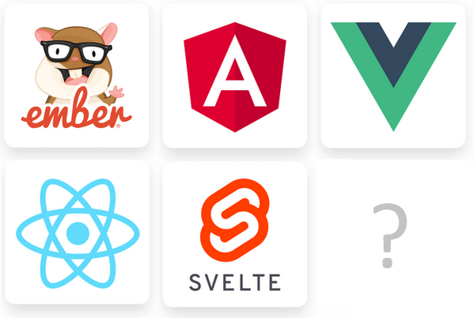

## Introduction


In the early days of the web all HTML was stored or generated on the server. As websites grew in complexity, developers began to use Javascript to dynamically change a page's markup.

In recent years a number of Javascript libraries have been developed to make browser-generated markup easier to manage.

In this module we will explore this style of "client-side" web app development using [React](https://reactjs.org/), an open-source UI library sponsored by Facebook.

#### Resources

- [React @ Wikipedia](https://en.wikipedia.org/wiki/React_%28web_framework%29)

## Objective

Upon completion of this module, you should be able to:

- Explain the purpose of a JS component library.
- Describe what a component is within the context of React.
- Write and render valid JSX markup.
- Build simple React components with configuration properties.
- Make use of loops and conditional within your components.

## Module Plan

- What are Components?
- Overview of Component Libraries
- Introduction to React
- JSX - XML in Javascript
- Components as Functions
- Props Stand for Properties
- Loops and Conditional

## Existing Component Libraries

{:class="small inline"}

You may have heard of front-end tools like Ember, Angular, React, Vue, or Svelte.

Despite what you may have read online about some of these frameworks being hot and others being not, they all have thriving communities.

Some have been around for a while (Ember) while others are relatively new (Svelte). They all have fans and detractors. They all have pros and cons.

For this course we've opted to teach **React**, but the ideas you learn in this module can be translated to the others.

_Today's hotness is tomorrow's old news. And so it goes._

#### Resources

- [2019 Front-End Framework Rankings](https://2019.stateofjs.com/front-end-frameworks/) - State of JS Survey
- Official Sites: [React](https://reactjs.org/), [Svelte](https://svelte.dev/), [Vue](https://vuejs.org/), [Angular](https://angular.io/), [Ember](https://emberjs.com/)

## Single Page Applications

{:class="small inline"}

Up to this point in the course we've been building sites with server-generated markup where every user interaction causes the browser to load a new server-rendered page.

React allows us to develop what are called **Single Page Applications** or **SPA**s for short.

Once a browser loads an SPA:

- All user interactions are handled by Javascript.
- Link clicks and form submissions no longer trigger page reloads.
- Javascript is used to fetch and submit JSON data while dynamically rewriting the page markup.

#### Resources

- [Single Page Application @ Wikipedia](https://en.wikipedia.org/wiki/Single-page_application)

## A Word About Web Components

{:class="small inline"}

There is [a W3C specification](https://github.com/w3c/webcomponents) called "Web Components".

Web Components allow you to create new custom, reusable HTML tags to use in web pages, but are different from React components.

We won't be covering Web Components in this course, but you might want to look into this complimentary technology.

#### Resources

- [What Are Web Components?](https://www.webcomponents.org/introduction)
- [Web Components Documentation @ MDN](https://developer.mozilla.org/en-US/docs/Web/Web_Components)

## Introducing React

{:class="small inline"}

**React** (also known as React.js) is a component library maintained by Facebook, along with a community of open-source developers.

It was first used internally at Facebook and Instagram in 2011/2012 and was released as an open-source library in 2013.

React is built on the following concepts:

- Declarative Components
- Embedded XML Syntax
- Immutable State

We'll review each of these in the coming sections.

#### Resources

- [Official React Website](https://reactjs.org/)
- [Tom Occhino and Jordan Walke Introduce React at JSConfUS 2013](https://www.youtube.com/watch?v=GW0rj4sNH2w) - Listed here for historical interest. The API has changed since then, so don't watch this video with the aim of learning modern React.

## What are Components?

{:class="small inline"}

When we talk about components in this module we mean **a named collection of HTML elements that accepts data and configuration properties**.

You can think of components as customizable HTML templates for reusable pieces of a web application.

Instead of messing with `document.createElement()` and friends to create our components, React allows us to _declare_ what we want built and the library deals with the DOM for us.

##An Example Page Component

The image above shows a possible component breakdown for a page within an application that includes a login area.

The `Page` component contains two "child" components, `Header` and `LoginArea`.

`LoginArea` is itself a "parent" of two "child" components, `UsernameField` and `PasswordField`.

#### Resources

- [Declarative Programming @ Wikipedia](https://en.wikipedia.org/wiki/Declarative_programming)
- [Inspiration for the above diagram](https://maksimivanov.com/posts/introduction-to-reactjs/).

## Local vs Cloud Development

{:class="small inline"}

Developing React applications locally on your laptop means installing and configuring the **Node.js** package manager **npm**.

We're going to skip local development, for now, in favour of building cloud-based React apps with [CodePen.io](https://codepen.io/).

_"CodePen is a social development environment for front-end designers and developers. Build and deploy a website, show off your work, build test cases to learn and debug, and find inspiration."_

📢 **Note:** [Sign-up for a CodePen account](https://codepen.io/accounts/signup/user/free) so that you can save your work.

#### Resources

- [Sign-Up for CodePen](https://codepen.io/accounts/signup/user/free) - Allows you to create cloud React apps.

📢 **Note:** [Use this React CodePen template to build your apps](https://codepen.io/stungeye/pen/rNxeMWL).

## CodePen - Live Code Examples

Some of code examples in these notes are embedded **CodePens**.

By the end of these notes you'll be able to build components like the `Country` component shown here:

<p class="codepen" data-height="330" data-theme-id="light" data-default-tab="js" data-user="stungeye" data-slug-hash="RwrKePZ"  data-pen-title="Simple React Component with Props">
  <span>See the Pen <a href="https://codepen.io/stungeye/pen/RwrKePZ">
  Simple React Component with Props</a> by Kyle Geske (<a href="https://codepen.io/stungeye">@stungeye</a>)
  on <a href="https://codepen.io">CodePen</a>.</span>
</p>

📢 **Note:** Click “edit on codepen” (top right corner) to mess around with the code. Try styling the component in the CSS tab.

## JSX

Consider the following Javascript:

```javascript
const header = <h1>Hello JSX!</h1>;
```

**Wait! Is that HTML mixed in with Javascript?**

_Almost..._

It's JSX, a syntax extension to Javascript that allows us to declare markup within our code.

JSX is XML in Javascript.

But watch out, JSX isn't built into Javascript. We need **Babel** to transpile our JSX into regular Javascript.

## Babel Compiles JSX into Pure Javascript

Go back to the last CodePen and click the "View Compiled" button to see the Javascript version of the JSX. Babel transpilation is built in to [our React CodePen Template](https://codepen.io/stungeye/pen/rNxeMWL) settings.

#### Resources

- [W3 Schools Intro to XML](https://www.w3schools.com/xml/xml_whatis.asp)
- [Babel](https://babeljs.io/) - The transpiler that allows us to use JSX in our Javascript.

## JSX Validity

Browsers are very forgiving when parsing markup. The following is valid HTML5:

```javascript
<p>We are not closing our paragraphs.
<p>
<p>And the img tag does not self close.
```

In order to be valid JSX we'd have to include the paragraph close tags and self-close the image tag with a trailing `/` like this:

```javascript

```

**The rules of JSX:**

- Tags with content must have close tags.
- Tags without content must "self-close" with a forward slash.

## Embedding Expressions in JSX

{:class="small inline"}

Use curly "moustache" braces to echo variables in JSX:

```javascript
const name = "Moustache Face";
const element = <h1>Hello, {name}!</h1>;

// <h1>Hello, Moustache Face!</h1>
```

Any valid Javascript expression works:

```javascript
const math = <p>2 plus 2 = {2 + 2}</p>;
const text = "Wally Glutton is a Ghost.";
const h2 = <h2>{text.replace("Wally", "Daisy")}</h2>;

// <p>2 plus 2 = 4</p>
// <h2>Daisy Glutton is a Ghost.</h2>
```

Use curly braces to set element attributes:

```javascript
const filename = "image.png";
const image = ;

// 
```

⚠️ **Warning:** When setting attributes don't wrap curly braces in quotes.

If you have: `const inputText = "Wooky!";`

✔️ Do: `<input value={inputText} />`

❌ Don't: `<input value="{inputText}" />`

❌ Don't: `<input value="inputText" />`

## Rendering JSX

We can display JSX within a webpage using `ReactDOM.render()`:

<p class="codepen" data-height="245" data-theme-id="light" data-default-tab="js" data-user="stungeye" data-slug-hash="YzwqGZL" style="height: 245px; box-sizing: border-box; display: flex; align-items: center; justify-content: center; border: 2px solid; margin: 1em 0; padding: 1em;" data-pen-title="Our First JSX Element">
  <span>See the Pen <a href="https://codepen.io/stungeye/pen/YzwqGZL">
  Our First JSX Element</a> by Kyle Geske (<a href="https://codepen.io/stungeye">@stungeye</a>)
  on <a href="https://codepen.io">CodePen</a>.</span>
</p>

`jsxElement` - The first argument of `ReactDOM.render()` is the JSX to render.

`rootElement` - The second arg is the render location in the HTML (DOM reference).

📢 **Note:** Click the HTML tab to see the `div#root` referenced by `rootElement`.

## CodePen Auto-Imports Dependencies

These CodePens were configured to auto-include the React dependencies, so missing from the code are the imports:

```javascript
import React from "react";
import ReactDOM from "react-dom";
```

## My First React Component

Let's render a simple React component:

<p class="codepen" data-height="265" data-theme-id="light" data-default-tab="js" data-user="stungeye" data-slug-hash="OJMNpZG" style="height: 265px; box-sizing: border-box; display: flex; align-items: center; justify-content: center; border: 2px solid; margin: 1em 0; padding: 1em;" data-pen-title="Hello React Component">
  <span>See the Pen <a href="https://codepen.io/stungeye/pen/OJMNpZG">
  Hello React Component</a> by Kyle Geske (<a href="https://codepen.io/stungeye">@stungeye</a>)
  on <a href="https://codepen.io">CodePen</a>.</span>
</p>

**Things to know about React components:**

- React components are functions name in CamelCase.
- Functional component return JSX.
- Components are declared as JSX elements of the same name: `<Hello />`

📢 **Note:** We won't be learning about legacy [class-based components](https://www.freecodecamp.org/news/functional-components-vs-class-components-in-react/).

## Props is Short for Properties

React components can be made configurable by accepting a single `props` parameter.

Let's update the `Hello` component to accept and use a `name` property:

```javascript
function Hello(props) {
  return <p>Hello {props.name}</p>;
}
```

A component's attributes become properties of the `props` object:

```javascript
<Hello name="Wally" />
<Hello name="Daisy" />
```

👆 In this example the values of the `name` attributes are assigned to `props.name` within the declared `Hello` components.

## Components within Component

To demo `props` let's nest two `Hello` components in a new `App` component:

<p class="codepen" data-height="400" data-theme-id="light" data-default-tab="js" data-user="stungeye" data-slug-hash="ZEQWyYq" style="height: 400px; box-sizing: border-box; display: flex; align-items: center; justify-content: center; border: 2px solid; margin: 1em 0; padding: 1em;" data-pen-title="React Components within Components">
  <span>See the Pen <a href="https://codepen.io/stungeye/pen/ZEQWyYq">
  React Components within Components</a> by Kyle Geske (<a href="https://codepen.io/stungeye">@stungeye</a>)
  on <a href="https://codepen.io">CodePen</a>.</span>
</p>

👆 Rendering the `App` component into the `rootElement` on the last line of code.

## Multiple Props

Components can accept any number of props. Let's add a `greeting` prop:

<p class="codepen" data-height="400" data-theme-id="light" data-default-tab="js" data-user="stungeye" data-slug-hash="xxZVJeV" style="height: 400px; box-sizing: border-box; display: flex; align-items: center; justify-content: center; border: 2px solid; margin: 1em 0; padding: 1em;" data-pen-title="Multiple Props React">
  <span>See the Pen <a href="https://codepen.io/stungeye/pen/xxZVJeV">
  Multiple Props React</a> by Kyle Geske (<a href="https://codepen.io/stungeye">@stungeye</a>)
  on <a href="https://codepen.io">CodePen</a>.</span>
</p>

📢 **Note:** The order of the attributes on a JSX element does not matter.

## Destructuring Props

Use a destructuring function parameter to unpack the prop object properties:

<p class="codepen" data-height="400" data-theme-id="light" data-default-tab="js" data-user="stungeye" data-slug-hash="eYJdoPY" style="height: 400px; box-sizing: border-box; display: flex; align-items: center; justify-content: center; border: 2px solid; margin: 1em 0; padding: 1em;" data-pen-title="Destructuring Props React">
  <span>See the Pen <a href="https://codepen.io/stungeye/pen/eYJdoPY">
  Destructuring Props React</a> by Kyle Geske (<a href="https://codepen.io/stungeye">@stungeye</a>)
  on <a href="https://codepen.io">CodePen</a>.</span>
</p>

👆 Instead of `props.greeting` and `props.name` we now use `greeting` and `name` within the component.

## Destructuring Function Parameters

Destructuring can be used for any function parameter in Javascript. For example:

```javascript
function logLove({ count, animals }) {
  console.log(`I love you as much as ${count} ${animals}.`);
}

const data = { count: 42, animals: "Elephants" };
logLove(data);
```

#### Resources

- [Unpacking fields from objects passed as function parameter - MDN](https://developer.mozilla.org/en-US/docs/Web/JavaScript/Reference/Operators/Destructuring_assignment#Unpacking_fields_from_objects_passed_as_function_parameter)

## Default Props Values

Destructuring the function parameter allows for prop defaults:

<p class="codepen" data-height="400" data-theme-id="light" data-default-tab="js" data-user="stungeye" data-slug-hash="pogyQBB" style="height: 400px; box-sizing: border-box; display: flex; align-items: center; justify-content: center; border: 2px solid; margin: 1em 0; padding: 1em;" data-pen-title="Default Props Values React">
  <span>See the Pen <a href="https://codepen.io/stungeye/pen/pogyQBB">
  Default Props Values React</a> by Kyle Geske (<a href="https://codepen.io/stungeye">@stungeye</a>)
  on <a href="https://codepen.io">CodePen</a>.</span>
</p>

👆 The `Hello` component can now be declared with zero, one, or two attributes.

#### Resources

- [Setting defaults for object parameters with destructuring - MDN](https://developer.mozilla.org/en-US/docs/Web/JavaScript/Reference/Operators/Destructuring_assignment#Setting_a_function_parameters_default_value)

## Loop Da Loop With Map

Use `map` to create components from collections of data:

<p class="codepen" data-height="385" data-theme-id="light" data-default-tab="js" data-user="stungeye" data-slug-hash="oNbxJwG" style="height: 385px; box-sizing: border-box; display: flex; align-items: center; justify-content: center; border: 2px solid; margin: 1em 0; padding: 1em;" data-pen-title="Looping with Map React">
  <span>See the Pen <a href="https://codepen.io/stungeye/pen/oNbxJwG">
  Looping with Map React</a> by Kyle Geske (<a href="https://codepen.io/stungeye">@stungeye</a>)
  on <a href="https://codepen.io">CodePen</a>.</span>
</p>

📢 **Note:** Components created with map must be assigned a unique `key` attribute.

_It's best to use database IDs for keys, but if IDs aren't available use the map index as above._

#### Resources

- [Lists and Keys - Official React Docs](https://reactjs.org/docs/lists-and-keys.html)

## Country Explorer App

{:class="small inline"}

**A "World Countries" React app using:**

- Array of country data from the [restcountries.eu](https://restcountries.eu/) API.
- `Country` component that accepts props for a name, population, area, and flag image url.
- `App` component that uses `map` to declare one `Country` component for each element in our country array.

📢 **Note:** Let's agree not to worry about how the data loading works for now.

_We'll learn a more integrated approach to loading data in React in a later module._

#### Resources

- [Sample Country JSON data returned from restcountries.eu](https://gist.github.com/stungeye/e34eee4f6665a077d320e15e2910b97a)

## React Countries App

Our shiny new Country App:

<p class="codepen" data-height="490" data-theme-id="light" data-default-tab="js" data-user="stungeye" data-slug-hash="dyGprML" style="height: 490px; box-sizing: border-box; display: flex; align-items: center; justify-content: center; border: 2px solid; margin: 1em 0; padding: 1em;" data-pen-title="React Countries Basic">
  <span>See the Pen <a href="https://codepen.io/stungeye/pen/dyGprML">
  React Countries Basic</a> by Kyle Geske (<a href="https://codepen.io/stungeye">@stungeye</a>)
  on <a href="https://codepen.io">CodePen</a>.</span>
</p>

📢 **Note:**

- Component styles are provided by [MVP.css](https://andybrewer.github.io/mvp/), which is a dependency of our codepen. There's a small amount of additional CSS in the CSS tab.
- The `Country` component leverages HTML details/summary elements for expandable content.
- JSX elements can be declared across multiple lines as seen within `App` where a `Country` element spans three lines.

## Conditional JSX - &&

We can optionally include JSX using a Boolean `&&`.

Let's add an optional `sup` element for densely populated countries:

<p class="codepen" data-height="410" data-theme-id="light" data-default-tab="js" data-user="stungeye" data-slug-hash="vYLXqWY" style="height: 410px; box-sizing: border-box; display: flex; align-items: center; justify-content: center; border: 2px solid; margin: 1em 0; padding: 1em;" data-pen-title="React Countries Conditional JSX">
  <span>See the Pen <a href="https://codepen.io/stungeye/pen/vYLXqWY">
  React Countries Conditional JSX</a> by Kyle Geske (<a href="https://codepen.io/stungeye">@stungeye</a>)
  on <a href="https://codepen.io">CodePen</a>.</span>
</p>

👆 Our first component with code above the return statement.

📢 **Note:** This technique works because `true && expression` always evaluates to `expression`, and `false && expression` always evaluates to `false`.

#### Resources

- [Conditional Rendering - Official React Docs](https://reactjs.org/docs/conditional-rendering.html)

## Conditional JSX - Ternary

Use a ternary to conditionally render different text or different components:

<p class="codepen" data-height="410" data-theme-id="light" data-default-tab="js" data-user="stungeye" data-slug-hash="pogEXBK" style="height: 410px; box-sizing: border-box; display: flex; align-items: center; justify-content: center; border: 2px solid; margin: 1em 0; padding: 1em;" data-pen-title="React Countries Ternary Conditional JSX">
  <span>See the Pen <a href="https://codepen.io/stungeye/pen/pogEXBK">
  React Countries Ternary Conditional JSX</a> by Kyle Geske (<a href="https://codepen.io/stungeye">@stungeye</a>)
  on <a href="https://codepen.io">CodePen</a>.</span>
</p>

👆 The `Region` component will display "None" if `region` prop is an empty string.

_Scroll to "Bouvet Island" to see this in action._

#### Resources

- [Official React Docs on Other Conditional Rendering Techniques](https://reactjs.org/docs/conditional-rendering.html)
- [Javascript Ternary Operator - MDN](https://developer.mozilla.org/en-US/docs/Web/JavaScript/Reference/Operators/Conditional_Operator)

## Build A Thing Now Will Yeah?

It's your turn.

Use one of these CodePen templates to build a React component.

- [Dogs]()
- [HTTP Cats]()
- [Pokemon]()
- [Star Wars Planets]()
- [Star Wars Characters]()

Each template is pre-wired to an API data source.

## JSX Quirks

As you work with JSX you'll notice that it differs from HTML in a few ways:

### Assigning a Class an Element

✔️ Do: Use `className` attribute instead of a `class` attribute.

### Event Handler Attributes

✔️ Do: Use CamelCase for all event attributes. Example: `onClick` instead of `onclick`.

### Associating Input Elements with Labels

✔️ Do: Use `htmlFor` attribute instead of a `for` attribute.

## JSX Quirks - Forms

A few JSX form inputs also differ from HTML:

### Textarea Element Values

✔️ Do use a `value` attribute: `<textarea value="☕" />`

❌ Don’t use content: `<textarea>☕</textarea>`

### Specifying Selected Options

✔️ Do specific selected option using a `value` attribute on the `select`:

```javascript
<select value="⚡">
  <option value="⚡">
  <option value="🎈">
</select>
```

❌ Don’t use the `selected` attribute to select an `option`:

```javascript
<select>
  <option selected value="⚡">
  <option value="🎈">
</select>
```

## What's Next?

You've now reviewed the basics of React.

In the next module you'll learn more advanced React topics like:

- Handling User Events
- Maintaining Component State
- Fetching JSON Data
- Handling Form Input
- Styling Components with CSS

## Code Sandbox Demo

<iframe src="https://codesandbox.io/embed/react-demo-48bs4?autoresize=1&fontsize=14&hidenavigation=1&theme=light"
     style="width:100%; height:500px; border:0; border-radius: 4px; overflow:hidden;"
     title="React Demo"
     allow="accelerometer; ambient-light-sensor; camera; encrypted-media; geolocation; gyroscope; hid; microphone; midi; payment; usb; vr; xr-spatial-tracking"
     sandbox="allow-forms allow-modals allow-popups allow-presentation allow-same-origin allow-scripts"
   ></iframe>

## REPL.IT Demo - Ruby in the Browser

<iframe height="400px" width="100%" src="https://repl.it/@stungeye/REST-API-Interaction-Star-Wars-JSON?lite=true" scrolling="no" frameborder="no" allowtransparency="true" allowfullscreen="true" sandbox="allow-forms allow-pointer-lock allow-popups allow-same-origin allow-scripts allow-modals"></iframe>

## REPL.IT DEMO - Java in the Browser

<iframe height="400px" width="100%" src="https://repl.it/@stungeye/Hello-Java?lite=true" scrolling="no" frameborder="no" allowtransparency="true" allowfullscreen="true" sandbox="allow-forms allow-pointer-lock allow-popups allow-same-origin allow-scripts allow-modals"></iframe>

## REPL.IT Demo - C# in the Browser

<iframe height="400px" width="100%" src="https://repl.it/@stungeye/C-Test?lite=true" scrolling="no" frameborder="no" allowtransparency="true" allowfullscreen="true" sandbox="allow-forms allow-pointer-lock allow-popups allow-same-origin allow-scripts allow-modals"></iframe>
