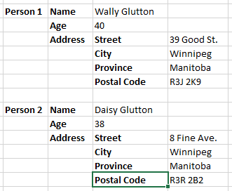
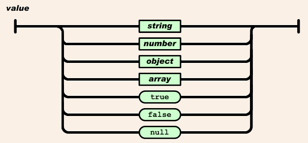

<!--prettier-ignore-start-->
# Javascript Object Notation
{: .no_toc }

**J**ava**S**cript **O**bject **N**otation, JSON for short, is file format for storing and exchanging structured data.

JSON is a human-readable text-based format based on how objects are defined in Javascript.

JSON data can be easily created and decoded in PHP, Javascript, and most other modern programming language.

## Table of Contents
{: .no_toc }

1. TOC
{:toc}

<!--prettier-ignore-end-->

## Introduction

**J**ava**S**cript **O**bject **N**otation, JSON for short, is file format for storing and exchanging structured data.

JSON is a human-readable text-based format based on how objects are defined in Javascript.

JSON data can be easily created and decoded in PHP, Javascript, and most other modern programming language.

#### Resources

- [JSON Entry @ Wikipedia](https://en.wikipedia.org/wiki/JSON)
- [Official JSON.org Website](http://json.org/)

## Objectives

Upon completion of this module, you should be able to:

- Explain the purpose of the JSON format.
- Describe the syntax of the JSON format.
- Explain the similarities and differences between JSON and XML.
- Encode structured data by hand in the JSON format.
- Fetch JSON from a file or URL in PHP.
- Encode, decode and access JSON data using PHP and Javascript.
- View and debug JSON data using an online JSON viewing tool.

## Structured Data



In order for computer programs to use and exchange information we must structure the data hierarchically and descriptively.

For example, to store information about a collection of people we might need some way to:

- Specify each person's name
- Specify each person's age.
- Specify each person's address. (Including a street, city, province and postal code.)
- Group the people together.

## Structured Data in XML

Here's that same structured data written as XML, the Extensible Markup Language.

```xml
<?xml version="1.0" encoding="UTF-8"?>
<people>
  <person>
    <name>Wally Glutton</name>
    <age>40</age>
    <address>
      <street>39 Good St.</street>
      <city>Winnipeg</city>
      <province>Manitoba</province>
      <postal_code>R3J 2K9</postal_code>
    </address>
  </person>
  <person>
    <name>Daisy Glutton</name>
    <age>38</age>
    <address>
      <street>8 Fine Ave.</street>
      <city>Winnipeg</city>
      <province>Manitoba</province>
      <postal_code>R3R 2B2</postal_code>
    </address>
  </person>
</people>
```

Before JSON came around in the early 2000s, XML was the defacto way to send structured data between applications.

## Structured Data in PHP - Arrays & Hashes

Using PHP we might encode our people data using nested hashes and arrays, like this:

```php
<?php

$people = [['name'    => 'Wally Glutton',
              'age'     => 40,
              'address' => ['street'     => '39 Good St.',
                            'city'        => 'Winnipeg',
                            'province'    => 'Manitoba',
                            'postal_code' => 'R3J 2K9']],
['name' => 'Daisy Glutton',
'age' => 38,
'address' => ['street' => '8 Fine Ave',
'city' => 'Winnipeg',
'province' => 'Manitoba',
'postal_code' => 'R3R 2B2']]];

?>
```

## Structured Data in JS - Arrays & Objects

Using Javascript we might encode our people data using nested objects and arrays, like this:

```javascript
var people = [
  {
    name: "Wally Glutton",
    age: 40,
    address: {
      street: "39 Good St.",
      city: "Winnipeg",
      province: "Manitoba",
      postal_code: "R3J 2K9",
    },
  },
  {
    name: "Daisy Glutton",
    age: 38,
    address: {
      street: "8 Fine Ave",
      city: "Winnipeg",
      province: "Manitoba",
      postal_code: "R3R 2B2",
    },
  },
];
```

## JSON Structured Data

The JSON version of this structure data is just like the Javascript version with three differences: The object keys are now strings, the variable assignment was removed, and the trailing semi-colon was removed.

```json
[
  {
    "name": "Wally Glutton",
    "age": 40,
    "address": {
      "street": "39 Good St.",
      "city": "Winnipeg",
      "province": "Manitoba",
      "postal_code": "R3J 2K9"
    }
  },
  {
    "name": "Daisy Glutton",
    "age": 38,
    "address": {
      "street": "8 Fine Ave",
      "city": "Winnipeg",
      "province": "Manitoba",
      "postal_code": "R3R 2B2"
    }
  }
]
```

This is why JSON stands for Javascript Object Notation. It's how we define structured objects in Javascript.

Notice how much more lightweight it is compared with XML. It's much shorter than the XML version and I'd argue much easier for a human to read without all the angle brackets.

JSON can also be minified (all whitespace removed) to be more efficient to transfer:

```
[{"name":"Wally Glutton","age":40,"address":{"street":"39 Good St.","city":"Winnipeg","province":"Manitoba","postal_code":"R3J 2K9"}},{"name":"Daisy Glutton","age":38,"address":{"street":"8 Fine Ave","city":"Winnipeg","province":"Manitoba","postal_code":"R3R 2B2"}}]
```

[Douglas Crockford](https://www.crockford.com/) discovered and standardized JSON in the early 2000s. The diagrams that follow are from his [json.org](https://www.json.org) website. Crockford describes JSON as "a light-weight, language independent, data interchange format".

#### Resources

- [RFC 4627](https://tools.ietf.org/html/rfc4627) - Crockford's original "Request for Comment" on the JSON specification to the Network Working Group, 2006.
- [RFC 7159](https://tools.ietf.org/html/rfc7159) - Current JSON specification as an RFC to the Internet Engineering Task Force (IETF), 2014.

## JSON Building Blocks

{:class="small"}

Although JSON is Javascript, there are some extra constraints.

JSON data must be contained in either an Array or an Object and the values contained within must be of the follow types:

- String
- Number (integer or float)
- Boolean
- null
- Arrays
- Objects

Further more, all strings must be double quoted and object keys must be strings.

Note that both Arrays and Objects can be nested within the JSON data.

## Javascript Objects and Arrays

{:class="small"}

Since a JSON structure must be contained in either an Object or an Array it's worth revisiting these structures.

Objects in Javascript are built as hashes (or what are sometimes called associative arrays). Objects are defined as comma-delimited collections of key/value pairs wrapped in curly braces.

Arrays in Javascript are defined as comma-delimited collections of values wrapped in square braces.

When building JSON we should use Arrays when storing collections of "things" and objects for storing named properties of "things".

## File Extension and MIME Type

The file extension that should be used for JSON files is `.json`.

A MIME type or internet media type is a two-part identifier for file formats transmitted on the Internet.

When sending or receiving JSON the specified MIME type should be `application/json`

Some legacy systems, however, may use `text/json` or `text/javascript`.

## Creating JSON with PHP

Assuming we have the PHP `$people` data structure defined above we can convert it to JSON and echo it to the requesting client like this:

```php
<?php
  // Set the JSON MIME content type so that it isn't sent as text/html
  header('Content-Type: application/json');

  // $people structure would be defined here.

  echo json_encode($people);
?>
```

That's it. The `json_encode` function takes care of everything!

#### Resources

- [json_encode @ PHP.net](https://secure.php.net/manual/en/function.json-encode.php)
- [json_last_error_msg @ PHP.net](https://secure.php.net/manual/en/function.json-last-error-msg.php)

## Fetching JSON data in PHP

The easiest way to load both local and remote JSON data from within a PHP script is using the `file_get_contents` method.

```php
// Load JSON from a file in the same folder as this script:
$json = file_get_contents('people.json');

// Load JSON from a URL:
$json = file_get_contents('https://dog.ceo/api/breeds/list');

// If a portion of the URL contains spaces or special characters it should be URL encoded it first:

$query    = urlencode('red river college');
$json_url = 'https://autocomplete.clearbit.com/v1/companies/suggest?query=' . $query;
$json     = file_get_contents($json_url);
```

In all cases the `$json` variable will be a String, assuming the URL contents loaded properly.

#### Resources

- [file_get_contents @ php.net](https://secure.php.net/manual/en/function.file-get-contents.php)
- [urlencode @ php.net](https://secure.php.net/manual/en/function.urlencode.php)

## Decoding JSON with PHP

We can decode JSON fetched from a URL using `json_decode`.

```php
<?php
  $dog_breeds_json = file_get_contents('https://dog.ceo/api/breeds/list');

  // By default the return value of json_decode is an object:
  $dog_breeds = json_decode($dog_breeds_json);
  $types_of_dogs = count($dog_breeds->message);

  // But we can also request a nested hash/array structure:
  $dog_breeds = json_decode($dog_breeds_json, true);
  $types_of_dogs = count($dog_breeds['message']);
?>
```

The actual JSON returned by the dog.ceo API call:

```json
{
  "status": "success",
  "message": [
    "affenpinscher",
    "african",
    "airedale",
    "akita",
    "appenzeller",
    "basenji",
    "beagle",
    /* Removed a number of the breeds for brevity! */
    "vizsla",
    "weimaraner",
    "whippet",
    "wolfhound"
  ]
}
```

#### Resources

- [json_decode @ PHP.net](https://secure.php.net/manual/en/function.json-decode.php)

## Accessing JSON Data in PHP

Assuming that our JSON people example was stored in a file named `people.json`:

```php
<?php
  $people_json = file_get_contents('people.json');
  $people = json_decode($people_json, true);
?>
<!DOCTYPE html>
<html>
<head>
	<meta charset=utf-8 />
	<title>JSON People</title>
</head>
<body>
  <p>The first person's name: <?= $people[0]['name'] ?></p>
  <p>The second person's city: <?= $people[1]['address']['city'] ?></p>
  <?php foreach($people as $person): ?>
    <p><?= $person['name'] ?> lives in <?= $person['address']['postal_code'] ?>.</p>
  <?php endforeach ?>
</body>
</html>
```

Notice that once we've decoded the JSON it's just a matter to indexing and looping standard PHP hashes and arrays.

When working with a new JSON structure it's common to inspect the decoded PHP structure using `print_r`:

```php
<pre><?php print_r($people) ?></pre>
```

## Creating JSON with Javascript

Although we saw earlier that JSON is Javascript (with some constraints) we can take Javascript Objects and Arrays and turn them into JSON strings by "stringifying" them:

```javascript
// Assumes access to the people variable defined above:
var peopleJSON = JSON.stringify(people);

// View the JSON string in the console:
console.log(peopleJSON);
```

Once JSON has been stringified it is just a string, you can no longer index into it to retrieve values.

## Decoding JSON with Javascript

If you receive JSON as a String in your Javascript you can parse it to an Object/Array structure:

```javascript
// Assuming the existing of a JSON string called peopleJSON:

var people = JSON.parse(peopleJSON);
```

## Accessing JSON Data in Javascript

Here's how we could access JSON nested data in Javascript assuming we have our people JSON stored in a peopleJSON String:

var people = JSON.parse(peopleJSON);

```javascript
// Print the first person's name
console.log(people[0]["name"]);

// Print the second person's city
console.log(people[1]["address"]["city"]);

// Loop through the people and print out some details.
for (var i = 0; i < people.length; i++) {
  var name = people[i]["name"];
  var age = people[i]["age"];
  var postal_code = people[i]["address"]["postal_code"];
  console.log(
    name +
      " is " +
      age +
      " years old and lives in the " +
      postal_code +
      " postal code."
  );
}
```

When accessing JSON data in a language other than Javascript we need to decode it to a native data structure first.

Actually, even in Javascript if we receive the JSON data as text it will need to be decoded to a Javascript data structure before it can be used.

## Viewing and Debugging JSON

JSON data can be difficult to debug, especially when it's computer generated without extra whitespace and indentation.

There are a number of online tools you can use to validate and "pretty print" the JSON you are working with for debugging purposes.

The JSON Viewer available at [codebeautify.org/jsonviewer](https://codebeautify.org/jsonviewer) can be used to validate (check for syntax errors), beautify (make more human readable) and minify (remove all whitespace) JSON data. It can also be used to convert JSON to XML or CSV formats.
