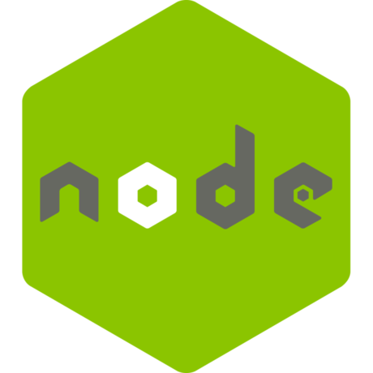
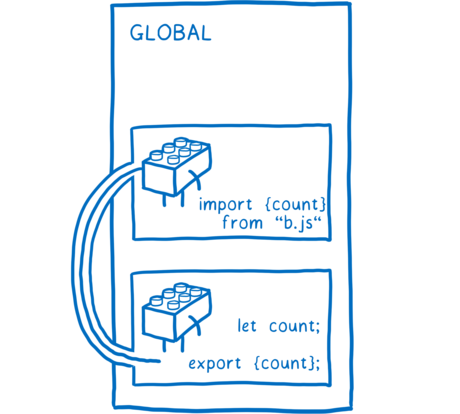
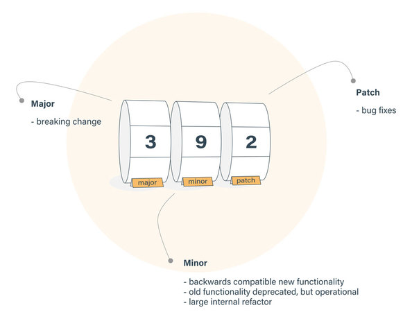

<!--prettier-ignore-start-->
# Javascript Modules and Bundling 
{: .no_toc }

## Table of Contents
{: .no_toc }

1. TOC
{:toc}

<!--prettier-ignore-end-->

## Introduction

{:class="small inline"}

For years there wasn't an easy standard way to import [open-source](https://opensource.com/resources/what-open-source) code into a Javascript project.

Even if you were able to integrate an open-source library into your code, keeping the library code updated with bug fixes and security patches was a pain.

In these notes you'll learn how to structure your Javascript code into modular components and how to import open-source modules written by others.

#### Resources

All images in this module are screenshots, official logos, or free no-attribution-required images from [Pixabay](https://pixabay.com) and [Unsplash](https://unsplash.com/).

## Objective

Upon completion of this module, you should be able to:

- Install the node package manager.
- Install the VS Code text editor.
- Explain why Javascript modules prevent namespace collisions.
- Write Javascript code that exports and imports functionality using ES Modules.
- Install open-source dependencies using the node package manager.
- Write Javascript code that imports functionality from a node package.
- Bundle your Javascript code using the Parcel bundler for development and production purposes.

## Module Plan

- The Command Line
- Required Tools
- History of Modules
- Namespace Collisions
- CommonJS and ES Modules
- Export and Import
- Bundling Modules
- Node Package Modules
- Demo Project Using NPM Modules
- Parcel Bundler
- Semantic Versioning
- Transpiling
- Browser Modules (Optional)

## In the Beginning

{:class="small inline"}

### Was the Command Line

The **command line** is a text-based interface for your operating system (OS). We run command line interface (CLI) tools using a **terminal**.

Web developers use CLI tools to write, test, and deploy their work.

In this lesson we'll be using a CLI tool to manage Javascript code modules.

#### 👋 Mac and Linux Users

Historically both MacOS and Linux have had a better terminal/CLI experience than Windows. It's [getting better in Windows-land](https://aka.ms/terminal), but many web dev professionals still favour Mac or Linux machines for this reason.

#### Resources

- [In the Beginning was the Command Line](http://cristal.inria.fr/~weis/info/commandline.html) by Neal Stephenson

## Required Tools

{:class="small inline"}

We need two things before we can proceed.

### Node Package Manager

To explore Javascript modules we need a way to install packages of modules written by other developers. For this we'll use the package manager that comes with NodeJS.

### VS Code Editor

VS Code is a free open-source code editor from Microsoft that runs on Windows, MacOS, and Linux. VS Code includes a built-in command line terminal and a healthy plugin ecosystem.

#### Resources

- [VS Code Plugin Repository](https://marketplace.visualstudio.com/vscode)

## A Word on Node

{:class="small inline"}

[NodeJS](https://nodejs.org) makes it possible to run Javascript applications outside of the browser.

With Node we can [write server-side code in JS](https://expressjs.com/) or [build cross-platform apps using web technologies](https://www.electronjs.org/). Super cool, but...

**NodeJS app development is outside the scope of this course.**

We're installing Node to use the Node Package Management application `npm`.

## Tools Installation

### NPM via NodeJS

**Windows:** [Use the `.msi` installer for the LTS version of NodeJS](https://nodejs.org/en/download/)

**MacOS:** [Use the `.pkg` installer for the LTS version of NodeJS](https://nodejs.org/en/download/) (Or use [homebrew](https://brew.sh/).)

**Ubuntu / Debian:** [Follow the "Option 2" PPA instructions shown here](https://www.digitalocean.com/community/tutorials/how-to-install-node-js-on-ubuntu-20-04#option-2-—-installing-node-js-with-apt-using-a-nodesource-ppa).

Instructions for other Linux flavours [are also available](https://nodejs.org/en/download/package-manager/).

### VS Code

**Windows, Mac, Linux:** [Install VS Code](https://code.visualstudio.com/).

You are free to use other editors like Atom or Sublime for this course. That said, these notes include VS Code specific material and your instructor will be using VS Code for coding demos.

## VS Code Settings

From the File Menu navigate to Preferences and then to Settings.

Search for and set the following settings.

Auto-save files 250ms after you switch tabs or leave the editor:

- Auto Save: onFocusChange
- Auto Save Delay: 250

Remove all whitespace at the end of lines:

- Trim Trailing Whitespace: true (or checked)

### Advanced Settings

For certain setting you will need to edit the VS Code `settings.json` file.

For example, it's very common to use only two spaces for Javascript indentation. Let's configure this manually.

From the Settings page click on the "Open Settings (JSON)" button at the top right. The icon is a document with an arrow.

Add the following key/value pair within the JSON object:

```javascript
"[javascript]": {
  "editor.tabSize": 2
},
```

## Modules - Some History

{:class="small inline"}

During the first twenty years of Javascript development (1995-2015) all of the code added to a web page shared a global namespace.

During this time, third-party libraries and frameworks were most commonly added to a Javascript codebase by manually downloading the library code and loading it through a `<script>` tag.

## Namespace Collisions

{:class="small inline"}

A global namespace worked for simple applications but if any included libraries used the same names for global functions, objects, or variables, the names would collide and the code would break.

Web developers came up with work-arounds, like using global objects as namespaces or [immediately-invoked function expressions](https://developer.mozilla.org/en-US/docs/Glossary/IIFE), but these solutions were not ideal.

## A Simple Example Collision

Imagine including the following in your `index.html` document:

```javascript
<script src="library.js"></script>
<script src="framework.js"></script>
<script src="index.js"></script>
```

In `library.js`:

```javascript
// Saves data to browser's localStorage.
function save(storageData) {
  // Implementation details skipped.
}
```

In `framework.js`:

```javascript
// Saves data to server logs using the fetch API.
function save(logData) {
  // Implementation details skipped.
}
```

And then somewhere in `index.js`:

```javascript
save("Important Data That Needs Saving!");
```

Which `save()` will run? The one from `library.js` or the one from `framework.js`?

## CommonJS and ES Modules

{:class="small inline"}

In 2009 NodeJS added a module system called **CommonJS**.

Browser code did not support modules until the 2015 addition of **ES Modules** to the Javascript specification.

🎉🎉🎉

We can now import code into our javascript apps in a safe and standard way!

#### Resources

- Image Source: [ES modules: A cartoon deep-dive](https://hacks.mozilla.org/2018/03/es-modules-a-cartoon-deep-dive/)

## Export and Import

Modules in Javascript are just files.

Files can export functionality which can then be imported by other files.

Two new keywords were added to the language to support this:

- `export`: Marks variables, functions, and objects as accessible from outside the current module.
- `import`: Used to import the functionality exported by other modules.

#### Resources

- [Modules Introduction @ Javascript.info](https://javascript.info/modules-intro)

## Export / Import Example

The file `colour.js` exports a function:

```javascript
export function randomColour() {
  return `#${Math.random().toString(16).slice(2, 8).padEnd(6, "0")}`;
}
```

The file `index.js` can now import and use the `randomColour` function:

```javascript
import { randomColour } from "./colour.js";

console.log(randomColour());
```

## Renamed Imports

To avoid name collisions we can change the name of imports:

```javascript
import { randomColour as randHex } from "./colour.js";

console.log(randHex());
```

## Export After Declaration

The `export` statement can also be used after the declaration.

Knowing this, our `colour.js` file could also be written:

```javascript
function randomColour() {
  return `#${Math.random().toString(16).slice(2, 8).padEnd(6, '0')}`;
}

export randomColour; // Export by name.
```

## Default Exports

A module might have a single `export` or it might `export` a number of functions, objects, or variables.

Single exports can be made `default`:

```javascript
// In textHelpers.js:

function reverse(str) {
  return [...str].reverse().join("");
}

export default reverse;

// And then in index.js:

import reverse from "./textHelpers.js";

console.log(reverse("Learn to Question"));
```

**⚠️ Warning: ** No curly braces around the import name when importing defaults.

## Bundling Modules

{:class="small inline"}

Although all modern browsers support modules, it isn't yet common practice to rely on browsers to load modules.

Instead, web developers use special programs called "bundlers" to \*bundle\*\* all their modules together.

Some common bundlers are [webpack](https://webpack.js.org/), [parcel](https://parceljs.org/), and [rollup](https://rollupjs.org/guide/en/).

_\*Bundle: When used as a verb, bundle means to "tie or roll up a number of things together as though into a parcel."_

#### Resources

- [Can I Use Browser Modules?](https://caniuse.com/#search=modules%20script%20tag) - Mid-2020: 8% of global web traffic comes from browsers without module support.

## Node Modules

An added benefit of bundling is the ability to easily integrate open source libraries.

Libraries are installed from the command line using the `npm` CLI.

The libraries you install with `npm` are tracked in the `package.json` and `package-lock.json` files, with their source code placed in a `node_modules` folder.

#### Resources

To get a sense of the size of the Javascript open-source ecosystem enabled by `npm`:

- [Awesome Javascript](https://github.com/sorrycc/awesome-javascript#readme) - A collection of awesome browser-side JavaScript libraries, resources and shiny things.

"Awesome Lists" like 👆 exist for all sorts of topics and technolgies:

- [Here's an Awesome List of Awesome Lists](https://github.com/sindresorhus/awesome) - Meta-meta!

## Initializing the Demo

Let's create a simple demo app using modules. To start:

- Create a new folder called `modules`.
- Open VS Code and add the `modules` folder to your workspace.
- Open the VS Code terminal. (Windows hotkey: `Ctrl` and `~`)

From the terminal, initialize the folder as a npm project:

```javascript
npm init -y
```

Take a peek at the `package.json` file that is now in your folder.

It should look something like this:

```javascript
{
  "name": "parcel-demo",
  "version": "1.0.0",
  "description": "Demo app using the parcel bundler.",
  "main": "index.js",
  "scripts": {
    "test": "echo \"Error: no test specified\" && exit 1",
  },
  "keywords": ["parcel", "demo"],
  "author": "Wally Glutton",
  "license": "Unlicense",
}
```

This metadata about your project can be updated by hand using any text editor.

## Install Node Packages

{:class="small inline"}

Let's install a package. For this demo we're going to use the Javascript charting library [chart.js](https://www.chartjs.org/).

From you VS Code terminal:

```javascript
npm install chart.js
```

Look at how your `package.json` file has changed.

There should now be a `dependencies` key defining a dependency to a specific version of chart.js.

You should also now have a `package-lock.json` file. This is a generated file that should not be manually edited.

The `package-lock.json` contains information about your dependencies and also about the dependencies of your dependencies. Look through this file and peek into the `node_modules` folder. By adding chart.js to your project you have actually added six package dependencies to your project instead of one.

#### Resources

- [Official Chart.js Documentation](https://www.chartjs.org/docs/latest/)

## Installing Parcel

{:class="small inline"}

We now need a way to bundle our code. For this we'll install the [Parcel](https://parceljs.org/) bundler.

Use your terminal to add **Parcel** as a development dependency:

```javascript
npm install parcel-bundler --save-dev
```

Note the changes to your `package.json` file.

There should now be a `devDependencies` key defining a development dependency to a specific version of parcel.

Take another look at your `package-lock.json` file to see all the new sub-dependencies you've now added to this project. By adding two packages (chart.js and parcel) your project now depends on over 750 packages! Imagine trying to manage these dependencies without a dependency manager.

**Note:** The development dependencies won't be bundled with the app for deployment.

## Why Parcel?

Although webpack is [the most popular bundler](https://2019.stateofjs.com/other-tools/), it is complex to configure from scratch.

The React apps we build this term will come pre-configured to use webpack, but we're using [Parcel](https://parceljs.org/) here because it requires "zero config" for simple apps.

#### Resources

- [Official Parcel Bundler Documentation](https://parceljs.org/getting_started.html)

## Project Files

We're going to create a simple app that displays a pie chart using the chart.js npm module we just added.

- **index.js** - Our script that will import and use chart.js.
- **index.css** - A minimal stylesheet.
- **index.html** - Markup that references other two files.

Create these files and fill with the contents found here:

[Contents of JS / CSS / HTML Files](https://gist.github.com/stungeye/278cc02fa670e3b5ffda31f546905d3c)

Take a look at the code and see if you can figure out what the output might be.

## Parcel Scripts

Most bundlers run in two modes:

- **Development Mode** - Powered by an HTTP server for use while you are writing and testing your code locally.
- **Build Mode** - Bundles and transpiles your code for product with the results written to static html, css and js files.

In order to run `parcel` in these two modes we need to update the `scripts` section of your `package.json` file to include:

```javascript
"dev": "parcel index.html",
"build": "parcel build index.html"
```

## Running Parcel's Development Script

Run the development script from the VS Code terminal:

```javascript
npm run dev
```

The `dev` script tells `parcel` to bundle up our `index.html` with the Javascript and CSS files referred to in the markup.

Node modules imported by the Javascript are also bundled.

The resulting bundle is then hosted by a built-in HTTP server on [localhost:1234](http://localhost:1234).

## Automatical Reloads

{:class="small inline"}

The parcel development server watches your files for changes.

Try changing the contents of the `h1` tag in the `index.html` file.

Notice that the browser page automatically updates to include your saved changes.

The same things goes for your Javascript files, your stylesheets, and dependency changes in your `package.json` file.

**Note:** The size of the chart depends on the CSS width applied to the `body`. Changing the body width in the `index.css` requires a manual reload of the page to properly resize the chart.

## Parcel Build

Run the build script from the VS Code terminal:

```javascript
npm run build
```

The `build` script instructs `parcel` to bundle our `index.html` with its dependencies and save the bundled files to a `dist` folder.

The files in the `dist` folder can now be deployed to a production HTTP server or cloud host.

Try serving the built project files from your Apache server! :)

## Semantic Versioning

{:class="small inline"}

When you look into your `package.json` file you will see that dependency version numbers are listed using the **semver** or semantic versioning format: **MAJOR.MINOR.PATCH**

Library authors increment the:

- MAJOR version when code changes break backwards compatibility.
- MINOR version when backward compatible new features are added.
- PATCH version when backwards compatible bug fixes are applied.

## Why Does This Matter?

By specifying the semver of a library in your `package.json` you ensure that you'll be able to rebundle your application in the future using the same library versions you used while you developed the application.

Without semver `npm` might accidentally bundle your application with newer but incompatible versions of a module.

To future proof your code, or for security reasons, you might want to allow `npm` to incorporate the latest MINOR or PATCH release of a dependency. There's a resource linked below with more information.

#### Resources

- [Configuring npm to Fetch the Latest Minor or Patch Version of a Module](https://stackoverflow.com/questions/22343224/whats-the-difference-between-tilde-and-caret-in-package-json)
- [Semantic Versioning Specification](https://semver.org/)
- [About Semantic Versioning and npm](https://docs.npmjs.com/about-semantic-versioning)
- Image Source: [Semantic Versioning Cheatsheet](https://bytearcher.com/goodies/semantic-versioning-cheatsheet/)

## Transpiling

{:class="small inline"}

Bundlers can also be configured to convert (or \*transpile\*\*) code written using modern Javascript syntax into old school Javascript.

Code that is bundled and transpiled will then run on older browsers that don't support modern Javascript syntax.

Parcel automatically uses [Babel](https://babeljs.io/) to transpile our bundled code.

By default Parcel uses Babel to target "every browser that has 0.25% or more of the total amount of active web users."

_\*Transpile: A process similar to compilation that translates source code from one programming language to another language, or from one version of a language to another version of that language._

#### Resources

- [Parcel Babel Default Transformations](https://parceljs.org/javascript.html#default-babel-transforms)

## Optional Advanced Topic

The following section on **Browser Modules** is optional.

It is included for those interested in the future of Javascript modules in the browser.

## Browser Modules

If you don't need `npm` packages, and your users have modern browsers, then you can load modules using the browser instead of a bundler.

This is done using a `type` attribute of `module` on your script tag:

```javascript
<script type="module">
  import reverse from './textHelpers.js'; console.log(reverse('Learn to
  Question'));
</script>
```

Or even:

```javascript
<script type"module" src="index.js"></script>
```

Assuming that `index.js` uses an `import` statement.

## How Browsers Load Modules

Files imported by scripts marked as `type="module"` are loaded using [Cross-Origin Resource Sharing](https://developer.mozilla.org/en-US/docs/Web/HTTP/CORS) (CORS) requests.

**⚠️ WARNING:** Browsers don't support CORS requests for local files using `file:///` URLs.

If you want to test browser modules your files need to be loaded from an HTTP server.

This could be the Apache server you already have installed, or you could install [the VS Code Live Server Extension](https://marketplace.visualstudio.com/items?itemName=ritwickdey.LiveServer).

### With VS Code Live Server Installed

Click "Go Live" in bottom status bar to launch an HTTP server on port 5500. Your `index.html` will open in the browser. As you make changes to your files the browser will automatically reload the page. Clicking "Port 5500" in the status bar will shut down the server.

#### Resources

- [Snowpack](https://www.snowpack.dev) - A build tool that leverages browser modules to remove bundling from your development workflow.
- [Browser Modules Documentation @ MDN](https://developer.mozilla.org/en-US/docs/Web/JavaScript/Guide/Modules)
