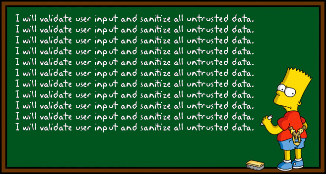
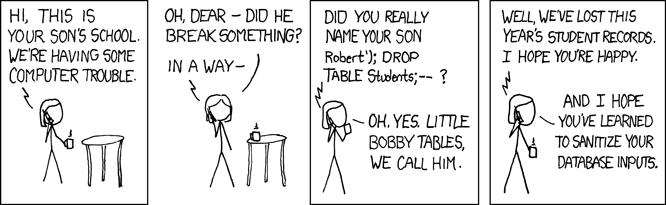
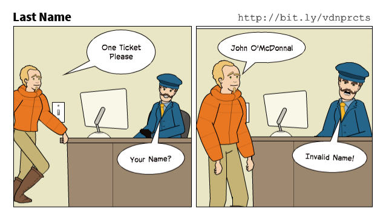
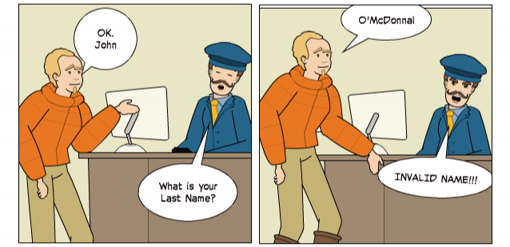
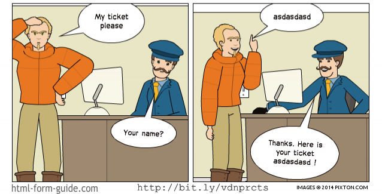

<!-- prettier-ignore-start -->
# User Input Validation and Sanitization 
{: .no_toc }

When accepting data into your web application from the outside world you need to ensure that this data is safe and meets your input expectations. This is a web security module.

## Table of Contents
{: .no_toc }

1. TOC
{:toc}

<!-- prettier-ignore-end -->

## Introductions

Most web applications make use of foreign data, information from the outside world. This data is used to control the flow of our applications. It may also end up in our database tables and eventually into our markup.

Ensuring that all data we use matches our expectations is important if we wish to keep our applications stable and secure.

We do this in two ways:

- **Data Validation** - _Checking_ Foreign Input
- **Data Sanitization** - _Cleaning_ Foreign Input

## Objectives



## Foreign Input

We must never trust foreign data.

The most common foreign data we deal with are the key/value parameters sent to our programs by way of URLs and HTML forms.

Foreign input sources:

- The `$_GET`, `$_POST` and `$_SERVER` Superglobals
- Session / Cookie Values
- Uploaded Files
- 3rd Party API Requests
- Internal Data Integration Systems

## A Word About Data Types

On the web, most foreign data arrives as a String.

A form used to submit an age will submit the string `'24'` not the integer `24`.

It's important to note that PHP will auto-cast a String variable to a number, if you use it as a number.

```php
<?php
    if($_POST['age'] > 20) { // $_POST['age'] is auto-cast to an integer.
        // ...
    }
?>
```

#### Resources

- [\$\_SERVER @ PHP.net](http://ca2.php.net/reserved.variables.server)

## Validation vs. Sanitization

**Validation** is verifying that data conforms to the rules you set for a particular input field. For example, when we ask for a user's age, we expect a positive number in return.

**Sanitization** is filtering data to remove corrupt or harmful information. For example, to block SQL Injection or Cross-Site Scripting (XSS) attacks.

## XSS Example

What would happen if you had a comment form on a website that accepted the following:

```html
<script type="text/javascript">
  alert("p0wnd");
</script>
```

## SQL Injection

What would happen if the same comment form accepted this input:

```sql
  '); DROP TABLE comments; --
```

#### Resources

- [Code Injection @ Wikipedia](https://en.wikipedia.org/wiki/Code_injection)
- [SQL Injection @ Wikipedia](https://en.wikipedia.org/wiki/SQL_injection)
- [XSS / HTML Injection @ Wikipedia](https://en.wikipedia.org/wiki/Cross-site_scripting)

## Exploits of a Mom



_Her daughter is named Help I'm trapped in a driver's license factory._

#### Resources

- [XKCD #327](https://xkcd.com/327/)
- [XKCD Explained #327](http://www.explainxkcd.com/wiki/index.php/327:_Exploits_of_a_Mom)

## Validations with filter_input()

Simple validations are often required to ensure that the input is present and reasonable. We might also need to ensure that our data matches the column type expectations of the database table where it will be stored.

For example, ensuring that a user's age was provided and that it is a positive whole number.

```php
<?php
    function valid_user_age() {
        return filter_input(INPUT_POST, 'user_age', FILTER_VALIDATE_INT) && ($POST['user_age'] >= 0);
    }
?>
```

#### Resources

- [filter_input() @ PHP.net](https://php.net/function.filter-input)
- [Available Validation Filters @ PHP.net](https://php.net/manual/en/filter.filters.validate.php)

## Sanitization with filter_input()

Sanitization can be used to prevent HTML injection by converting certain characters to HTML entities.

```php
<?php
    function filtered_comment() {
        return filter_input(INPUT_POST, 'comment', FILTER_SANITIZE_FULL_SPECIAL_CHARS);
    }
?>
```

The malicious comment:

```html
<script type="text/javascript">
  alert("p0wnd");
</script>
```

Becomes:

```php
&lt;script type=&#039;text/javascript&#039;&gt;alert(&#039;p0wnd&#039;);&lt;/script&gt;gt;
```

Often we combine validation and sanitization.

```php
<?php
    function filtered_user_status() {
        return filter_input(INPUT_POST, 'user_status', FILTER_SANITIZE_FULL_SPECIAL_CHARS);
    }

    function valid_user_status() {
        $status_length = strlen(filtered_user_status());
        return $status_length > 0 && $status_length <= 140;
    }
?>
```

#### Resources

- [Available Sanitization Filters @ PHP.net](https://php.net/manual/en/filter.filters.sanitize.php)

## Over Zealous Validation







#### Resources

- Cartoon Source: [HTMLFormGuide.com Validation Guide](http://www.html-form-guide.com/best-practices/form-validations-definitive-guide.html)
