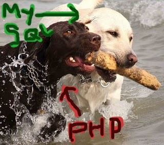

<!-- prettier-ignore-start -->
# Database-Backed PHP Apps
{: .no_toc }

These day we rarely code a complex PHP application that does not make use of a database for back-end data storage. For this course we will be using the MySQL database as our database back-end.

## Table of Contents
{: .no_toc }

1. TOC
{:toc}

<!-- prettier-ignore-end -->

## Introduction

{:class="small inline"}

PHP and MySQL play _very_ nicely together. In this module you will be using the PHP Data Objects extension (PDO) to connect your PHP scripts to a MySQL database.

PHP + MySQL = Best Friends Forever!

## Objectives

By the end of this module, you will be able to:

- Establish a connection to a MySQL database from your PHP scripts.
- Use this connection to execute SQL queries on your database tables.
- Using SQL you will be able to perform the following tasks on your tables:
  - C - Create
  - R - Read
  - U - Update
  - D - Delete

## Setting Up Our Tables

{:class="small"}

All the database tables we use in this class must contain a column named `id`. This `id` column should be:

- An INT of size 11.
- Auto-incrementing.
- The table's primary key.

This column allows us to uniquely identify any row of any table by number.

## SQL User Administration

Ensure that the MySQL server is by logging into [PHPMyAdmin](http://localhost:31337/phpmyadmin). We will now configure a MySQL user that we will use for all our course work:

From the PHPMyAdmin SQL tab execute:

```sql
CREATE DATABASE serverside;
CREATE USER 'serveruser'@'localhost' IDENTIFIED BY 'gorgonzola7!';
GRANT SELECT, INSERT, UPDATE, DELETE, CREATE, DROP, ALTER
  ON serverside.* TO 'serveruser'@'localhost';
```

## PHP Data Objects

The PHP Data Objects extension _(PDO)_ allows you to access the functionality provided by a SQL server in an _object-oriented_ manner.

Provided by the _PDO_ extension is the _MySQL Driver_ which represents a connection between PHP and a MySQL database. By changing the PDO Driver you can switch between different types of database servers.

**Remember:** In PHP object methods are called using the stabby operator `->` as follows:

`$favourite_noun->the_best_method_in_the_world($coolest_parameter_evar);`

_Assuming we've already instantiated an object called `$favourite_noun`._

#### Resources

- [PDO @ php.net](https://php.net/manual/en/book.pdo.php)
- [Available PDO Database Drivers](https://php.net/manual/en/pdo.drivers.php)

## PDO Connect

Before a PHP script can query a MySQL database it must connect to the database server by creating an PDO object.

```php
<?php
    define('DB_DSN','mysql:host=localhost;dbname=serverside;charset=utf8');
    define('DB_USER','serveruser');
    define('DB_PASS','gorgonzola7!');

    // Create a PDO object called $db.
    $db = new PDO(DB_DSN, DB_USER, DB_PASS);
?>
```

_Tips and Gotchas:_

- The Data Source Name or DSN string can include an optional port number: `mysql:host=localhost;port=3307;dbname=serverside`

## Connect Error Handling

We can add error handing to the previous connection script using a try/catch block.

```php
<?php
    define('DB_DSN','mysql:host=localhost;dbname=serverside');
    define('DB_USER','serveruser');
    define('DB_PASS','gorgonzola7!');

    try {
        $db = new PDO(DB_DSN, DB_USER, DB_PASS);
    } catch (PDOException $e) {
        print "Error: " . $e->getMessage();
        die(); // Force execution to stop on errors.
    }
?>
```

_Tips and Gotchas:_

- When deploying an application to production you would likely want to handle the catching of db errors more gracefully, rather than just calling `die`.

#### Resources

- [Try/Catch in PHP](https://php.net/manual/en/language.exceptions.php)

## PDO Database Statements

SQL queries are submitted as strings to the PDO object.

```php
<?php
    $query = "INSERT INTO quotes (author, content) values ('Wally Glutton', 'Learn to Question')";
    $statement = $db->prepare($query);
    $statement->execute();
?>
```

_Tips and Gotchas:_

- The above code assumes that we have already created a PDO object called `$db`.

#### Resources

- [PDO::prepare](https://php.net/manual/en/pdo.prepare.php)
- [PDOStatement::execute](https://php.net/manual/en/pdostatement.execute.php)

## PDO SELECT

A select statement is used to select rows from a table.

```php
<?php
    $query = "SELECT * FROM quotes";
    $statement = $db->prepare($query); // Returns a PDOStatement object.
    $statement->execute(); // The query is now executed.
?>
```

Below in the HTML we can loop through the retrieved rows:

```php
<h1>Found <?= $statement->rowCount() ?> Rows</h1>
<ul>
    <?php while ($row = $statement->fetch()): ?>
        <li><?= $row['author'] ?> said <?= $row['content'] ?></li>
    <?php endwhile ?>
</ul>
```

_Tips and Gotchas:_

- Each `$row` is an associative array with the retrieved column names as keys.
- Selection can specify a comma delimited list of columns, instead of simple the "\*" wildcard.

#### Resources

- [PDOStatement::rowCount](https://php.net/manual/en/pdostatement.rowcount.php)
- [PDOStatement::fetch](https://php.net/manual/en/pdostatement.fetch.php)

## Fetch All

After selecting rows from a table you can retrieve an array of all the rows using the `fetchAll()` method, rather than fetching row by row from the statement.

```php
<?php
    $query = "SELECT * FROM quotes";
    $statement = $db->prepare($query); // Returns a PDOStatement object.
    $statement->execute(); // The query is now executed.
    $quotes= $statement->fetchAll();
?>
```

Below in the HTML we can loop through the retrieved rows:

```php
<ul>
    <?php foreach($quotes as $quote): ?>
        <li><?= $quote['author'] ?> said <?= $quote['content'] ?></li>
    <?php endforeach ?>
</ul>
```

_Tips and Gotchas:_

- Just like with `fetch` the rows in the array returned by `fetchAll` are associative arrays with column names as keys.

#### Resources

- [PDOStatement:fetchAll](https://secure.php.net/manual/en/pdostatement.fetchall.php)

## PDO WHERE

A WHERE clause can be added to any select statement to enforce conditions on the returned rows. The WHERE clause takes the form:

```sql
WHERE condition1 [AND/OR] condition2 [AND/OR] condition3...
```

The conditions specify a column name, an operator, and a comparison value.

```php
<?php
    $query = "SELECT * FROM quotes WHERE id > 7";
    $statement = $db->prepare($query);
    $statement->execute();
?>
```

_Tips and Gotchas:_

- Where clauses can also be added to UPDATE and DELETE statements.
- Interpolating user data directly into a WHERE clause can be a security issue. We will guard against this on the next slide using parameterize queries.

## PDO WHERE With User Data

Imagine we wanted to include some user data in one of our SQL queries. Perhaps we wish to load a specific row from a table based on an id provided as a GET parameter.

The naive solution would be:

```php
<?php
    $query = "SELECT * FROM quotes WHERE id = {$_GET['id']}"; // DANGER! DANGER!
    $statement = $db->prepare($query);
    $statement->execute();
?>
```

User data can never be trusted. In the above example we are injecting user data directly into our SQL which can lead to SQL Injection attacks. Please never do this.

#### Resources

- [SQL Injection Attacks](https://en.wikipedia.org/wiki/SQL_injection)

## PDO WHERE With User Data

The safe way to add user data to our SQL is to first sanitize the data and then use a parameterized SQL statement.

```php
<?php
    // Sanitize $_GET['id'] to ensure it's a number.
    $id = filter_input(INPUT_GET, 'id', FILTER_SANITIZE_NUMBER_INT);

    // Build a query using ":id" as a placeholder parameter.
    $query = "SELECT * FROM quotes WHERE id = :id";
    //the PDO::prepare function returns a PDOStatement object
    $statement = $db->prepare($query);

    // Bind the :id parameter in the query to the previously
    // sanitized $id specifying a type of INT.
    $statement->bindValue(':id', $id, PDO::PARAM_INT);
    // Then execute the prepared statement.
    $statement->execute();
?>
```

The sanitization of the id using `filter_input` in the above example may be overkill since `bindValue` when used with `PDO::PARAM_INT` should sanitize the parameter as an integer. However, it doesn't really hurt to be too careful.

#### Resources

- [filter_input](https://php.net/manual/en/function.filter-input.php)
- [PDOStatement::BindValue](https://php.net/manual/en/pdostatement.bindvalue.php)

## PDO INSERT

The insert statement is used to insert new rows into a specific table. The insert statement takes the form:

```sql
INSERT INTO table_name ( column1, column2,...columnN ) VALUES ( value1, value2,...valueN )
```

```php
<?php
    // Sanitize user input to escape HTML entities and filter out dangerous characters.
    $author  = filter_input(INPUT_POST, 'author', FILTER_SANITIZE_FULL_SPECIAL_CHARS);
    $content = filter_input(INPUT_POST, 'content', FILTER_SANITIZE_FULL_SPECIAL_CHARS);

    // Build the parameterized SQL query and bind sanitized values to the parameters
    $query     = "INSERT INTO quotes (author, content) values (:author, :content)";
    $statement = $db->prepare($query);
    $statement->bindValue(':author', $author);
    $statement->bindValue(':content', $content);

    // Execute the INSERT prepared statement.
    $statement->execute();

    // Determine the primary key of the inserted row.
    $insert_id = $db->lastInsertId();
?>
```

_Tips and Gotchas:_

- When inserting user-supplied data be sure to sanitize it first using `filter_input`.
- The above code requires an HTML form to POST the author and content data.

#### Resources

- [Available Sanitize Filters for filter_input](https://php.net/manual/en/filter.filters.sanitize.php)
- [PDO::lastInsertId](https://php.net/manual/en/pdo.lastinsertid.php)

## PDO UPDATE

The update statement is used to modify existing rows in the database. One or more columns can be updated. The update statement has the form:

```sql
UPDATE table_name SET column1=new-value1, column2=new-value2 [WHERE Clause]
```

```php
<?php
    // Sanitize user input to escape HTML entities and filter out dangerous characters.
    $author  = filter_input(INPUT_POST, 'author', FILTER_SANITIZE_FULL_SPECIAL_CHARS);
    $content = filter_input(INPUT_POST, 'content', FILTER_SANITIZE_FULL_SPECIAL_CHARS);
    $id      = filter_input(INPUT_POST, 'id', FILTER_SANITIZE_NUMBER_INT);

    // Build the parameterized SQL query and bind the sanitized values to the parameters
    $query     = "UPDATE quotes SET author = :author, content = :content WHERE id = :id";
    $statement = $db->prepare($query);
    $statement->bindValue(':author', $author);
    $statement->bindValue(':content', $content);
    $statement->bindValue(':id', $id, PDO::PARAM_INT);

    // Execute the INSERT.
    $statement->execute();
?>
```

_Tips and Gotchas:_

- If no WHERE clause is specified all rows will be updated.
- To ensure that a WHERE clause can only affect a single row you can add `LIMIT 1` to the end of your query.
- The above code requires an HTML form to POST the author, content and id.

## PDO DELETE

The delete statement is used to delete rows from a database table. The delete statement has the form:

```sql
DELETE FROM table_name [WHERE Clause]
```

```php
<?php
    $id = filter_input(INPUT_POST, 'id', FILTER_SANITIZE_NUMBER_INT);
    $query = "DELETE FROM quotes WHERE id = :id";
    $statement = $db->prepare($query);
    $statement->bindValue(':id', $id, PDO::PARAM_INT);
    $statement->execute();
?>
```

_Tips and Gotchas:_

- If no WHERE clause is specified all rows will be deleted.
- To ensure that only one row is deleted you can place `LIMIT 1` at the end of your query.
- The above code requires an HTML form to POST the id.

## Binding a Hash to a Statement

Up to this point, if we had multiple parameters in a prepared statement we would have to make multiple calls to `bindValue`. However, we can bind multiple parameters using a hash.

```php
<?php
    $author = filter_input(INPUT_POST, 'author', FILTER_SANITIZE_FULL_SPECIAL_CHARS);
    $content = filter_input(INPUT_POST, 'content', FILTER_SANITIZE_FULL_SPECIAL_CHARS);

    $query  = "INSERT INTO quotes (author, content) values (:author, :content)";
    $statement = $db->prepare($query);

    $bind_values = ['author' => $author, 'content' => $content];
    $statement->execute($bind_values);
?>
```

_Tips and Gotchas:_

- The parameters in the query start with colons but the keys in the hash do not. The colon is optional in the hash keys.

## Advanced PDO Topics

These notes cover the basics of using PDO with a MySQL database. Here are some links to more advanced topics:

- [Example Advanced PDO Code](http://stungeye.com/school/pdo/) (Written by a former student.)
- [PDO Errors and Error Handling](https://php.net/manual/en/pdo.error-handling.php)
- [Database Transactions with PDO](https://php.net/manual/en/pdo.transactions.php)

## Google Coding AKA Copypasta

In this course we are _only_ using PDO for database access.

Be wary of example code you find online that uses the _mysql_ or _mysqli_ extensions.

**Code written using the _mysql_ and _mysqli_ extensions will not be accepted for challenges or assignments.**

If you wish to use a database abstraction other that PDO for you work, please ask for special permission from your instructor.

{:class="large"}
